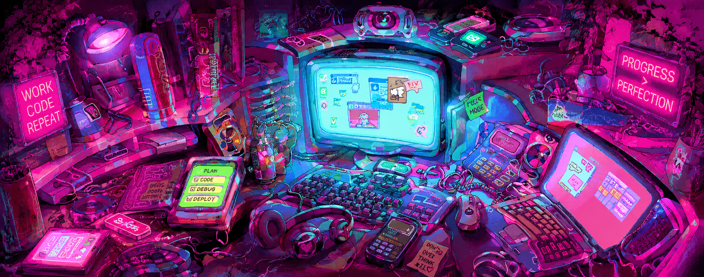

<!-- 🖼️ Custom Profile Banner -->

  

---

# ✧ Khushi Bisht ✧
### *Computer Science Student & AI/ML Enthusiast*

 

<!-- 🏷️ Custom Badges with Pink Theme -->

---

# 💖 About Me

> ### ─── ❖ ── ✦ ── ❖ ───
>
> *I am an **AI/ML enthusiast** and computer science student who thrives at the intersection of analytical logic and pure imagination. By day, I dive deep into structured code, build predictive pipelines, and unpack complex data metrics.*
>
> *When I step away from the screen, I balance my technical focus through the fluid world of traditional painting and sketching. For me, clean programming logic and visual art are two sides of the same coin—both require extreme attention to detail, perspective, and out-of-the-box creative thinking to bring raw ideas to life.*
>
> ### ─── ❖ ── ✦ ── ❖ ───

---

# 🌐 Connect

