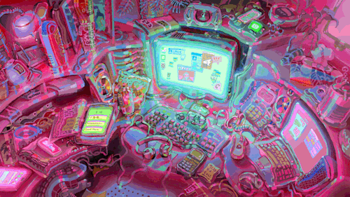

<!-- 🖼️ Custom Profile Banner -->

  

---

<h2 align="center">About Me</h2>

<table border="0" cellpadding="10" cellspacing="0" align="center">
  <tr>
    <td width="30%" align="center" valign="middle">
      
    </td>
    <td width="70%" valign="middle">
      

        I am an <b>AI/ML enthusiast</b> and computer science student driven by the intersection of analytical logic and pure imagination. By day, I am diving deep into structured code, exploring predictive pipelines, and unpacking data metrics. When I step away from the screen, I balance my technical focus through painting and sketching. For me, clean programming logic and visual art are two sides of the same coin—both require extreme attention to detail, perspective, and out-of-the-box creative thinking to bring raw ideas to life.
      

    </td>
  </tr>
</table>

<!-- 🤝 CONNECT BLOCK (Positioned under About Me) -->
<table border="1" cellspacing="0" cellpadding="15" align="center" style="border-color: #30363d; border-radius: 6px;">
  <tr>
    <td align="center" bgcolor="#0d1117">
      Connect 
       
      
      &nbsp;&nbsp;
      
      &nbsp;&nbsp;
      
     
    </td>
  </tr>
</table>

---

<h3 align="center">📊 GitHub Analytics</h3>

  
  

---

